# MemoryServerTTS 项目完整技术文档

> **版本**：2.1 | **更新**：2026-08-10（短/长文本分治、单词语音校验闭环、词库缓存 Phase 2） | **语言**：Python 3.12 | **框架**：FastAPI + Uvicorn | **TTS**：Qwen3-TTS | **ASR**：Faster-Whisper

---

> 🔥 **修改代码前必读**：[约束与约定文档](CONSTRAINTS.md)（架构/模型/接口/缓存/并发边界，约束编号 C/M/G/D/A/P/T）

## 目录

1. [项目概述](#1-项目概述)
   - [1.1 项目定位](#11-项目定位)
   - [1.2 核心能力矩阵](#12-核心能力矩阵)
   - [1.3 项目文件结构](#13-项目文件结构)
2. [技术架构](#2-技术架构)
   - [2.1 总体架构图](#21-总体架构图)
   - [2.2 技术栈详解](#22-技术栈详解)
   - [2.3 服务端-客户端联动全景](#23-服务端-客户端联动全景)
3. [环境依赖](#3-环境依赖)
4. [模块详解](#4-模块详解)
   - [4.1 TTS 模型管理器 — `src/tts/model_loader.py`](#41-tts-模型管理器--srcttsmodel_loaderpy)
     - [4.1.1 短/长文本分治与单词语音校验闭环](#411-短长文本分治与单词语音校验闭环2026-08-起)
   - [4.2 ASR 模型管理器 — `src/asr/model_loader.py`](#42-asr-模型管理器--srcasrmodel_loaderpy)
   - [4.3 发音评价器（MFCC+DTW）— `pronunciation/evaluator.py`](#43-发音评价器mfccdtw--pronunciationevaluatorpy)
   - [4.4 G2P 引擎 — `pronunciation/g2p_engine.py`](#44-g2p-引擎--pronunciationg2p_enginepy)
   - [4.5 音素发音评价器 — `pronunciation/phoneme_evaluator.py`](#45-音素发音评价器--pronunciationphoneme_evaluatorpy)
   - [4.6 FastAPI 主服务 — `server.py`](#46-fastapi-主服务--serverpy)
   - [4.7 调试与测试工具](#47-调试与测试工具)
5. [API 接口详解](#5-api-接口详解)
   - [5.1 接口总览](#51-接口总览)
   - [5.2 TTS 语音合成](#52-tts-语音合成)
   - [5.3 ASR 语音识别](#53-asr-语音识别)
   - [5.4 发音评价](#54-发音评价)
   - [5.5 系统接口](#55-系统接口)
6. [与 MemoryServer 的联动设计](#6-与-memoryserver-的联动设计)
7. [配置说明](#7-配置说明)
8. [部署指南](#8-部署指南)
9. [开发与调试](#9-开发与调试)
10. [常见问题与排错](#10-常见问题与排错)
---

## 1. 项目概述

### 1.1 项目定位

MemoryServerTTS 是"记忆英语"（Memory English Learning App）生态中的 **语音服务中间件**，为上层的 Java SpringBoot 后端（MemoryServer）提供三大智能语音能力：

- **语音合成（TTS）**：基于阿里通义千问第 3 代语音合成模型 Qwen3-TTS，将文本转化为自然流畅的多语言语音
- **语音识别（ASR）**：基于 CTranslate2 加速的 Faster-Whisper，将用户语音转写为文字
- **发音评价**：评估用户发音准确度，提供从整体评分到逐词、逐音素的精细化诊断反馈

```mermaid
graph LR
    subgraph Client["📱 Android 客户端"]
        APP["MemoryApp"]
    end
    subgraph JavaServer["🖥️ MemoryServer (Java SpringBoot)"]
        TTS_SVC["TTSService"]
        PRON_SVC["PronunciationService"]
        CONV_SVC["ConversationService"]
    end
    subgraph PythonServer["🎵 MemoryServerTTS (Python FastAPI)"](
        TTS["TTS 合成"]
        ASR["语音识别"]
        EVAL["发音评价"]
    end

    Client <--> JavaServer
    JavaServer -->|"HTTP REST + WebSocket"| PythonServer
```

### 1.2 核心能力矩阵

| 能力 | 核心技术 | 输入 | 输出 | 典型调用方 |
|------|---------|------|------|-----------|
| **TTS 合成** | Qwen3-TTS 0.6B/1.7B | 文本 + 音色 + 语言 | WAV 音频流 | AI 对话、听写播放、单词发音 |
| **TTS 流式** | Qwen3-TTS + WebSocket | 分段文本 | Base64 PCM16 音频块 | 实时对话语音回复 |
| **ASR 转录** | Faster-Whisper base | 音频文件 (.wav/.mp3/.flac/.m4a) | 文本 + 时间戳 + 语言检测 | AI 对话语音输入、发音评价前置 |
| **音素评价** | ASR + G2P + 编辑距离 | 学生录音 + 参考文本 | 逐词/逐音素诊断 | 发音纠正模块 |
| **声学评价** | MFCC + DTW | 学生录音 + 标准音频 | 整体相似度评分 | 跟读对比练习 |
)(
### 1.3 项目文件结构

```text
MemoryServerTTS/
├── main.py                         # 应用入口（uvicorn 启动，RELOAD 环境变量控制热重载）
├── requirements.txt                # Python 依赖清单
├── Dockerfile                      # Docker 容器化配置
├── README.md                       # 项目简介
├── "# environment.yml"             # Conda 环境定义（memory-tts）
├── config/                         # 模块配置（YAML，TTSConfig/OCRConfig 读取）
│   ├── tts.yaml                    # TTS 配置：模型/解码策略/校验闭环/词库缓存
│   └── ocr.yaml                    # OCR 配置
├── start_server.bat                # Windows 一键启动
├── start_server.sh                 # Linux/macOS 一键启动
│
├── src/                            # 核心源代码（按模块分包）
│   ├── __init__.py
│   ├── server.py                   # FastAPI 主服务（路由挂载 + 生命周期 + WebSocket）
│   ├── common/                     # 公共组件
│   │   ├── base_config.py          # 配置基类（YAML + 环境变量覆盖）
│   │   └── logging.py              # 统一日志（[模块] 前缀 + ANSI 彩色）
│   ├── tts/                        # TTS 模块（Qwen3-TTS）
│   │   ├── config.py               # TTSConfig（解码参数/校验参数/词库缓存配置）
│   │   ├── model_loader.py         # TTSModelManager（单例 + 1.7B/0.6B 降级 + 短长文本分治）
│   │   ├── router.py               # /api/v1/tts/* 路由
│   │   └── verifier.py             # ASR 回读校验（宽松匹配 + 置信度门槛）
│   ├── asr/                        # ASR 模块（Faster-Whisper）
│   │   ├── model_loader.py         # ASRModelManager（单例）
│   │   └── router.py               # /api/v1/asr/* 路由
│   ├── pronunciation/              # 发音评价模块
│   │   ├── evaluator.py            # MFCC+DTW 声学评价器
│   │   ├── phoneme_evaluator.py    # G2P+ASR 音素级评价器（核心创新）
│   │   ├── g2p_engine.py           # G2P 引擎（英文 g2p-en / 中文 pypinyin）
│   │   └── router.py               # /api/v1/pronunciation/* 路由
│   ├── ocr/                        # OCR 模块（PaddleOCR）
│   │   ├── config.py / engine.py / router.py
│   ├── dictation/                  # 🔥 词库缓存（听写场景，Phase 2）
│   │   ├── cache.py                # 缓存存储（key=hash(word|voice|lang|instruct|版本)，原子写入）
│   │   ├── generator.py            # best-of-N 预生成 + quality_score 评分
│   │   ├── spec.py                 # 词条规格归一化（语言别名 + 母语音色匹配）
│   │   ├── router.py               # /api/v1/dictation/* 路由（含管理端接口）
│   │   └── pregenerate.py          # 离线预生成 CLI（强制 1.7B）
│   └── dashboard/                  # 管理后台
│       ├── router.py               # /admin 页面路由
│       └── templates/index.html    # 单页后台（系统概览/TTS/ASR/发音/OCR/词库管理/测速）
│
├── models/                         # AI 模型文件
│   ├── qwen-1.7b/                  # Qwen3-TTS 1.7B 主模型（推荐，~3.4GB VRAM）
│   │   ├── config.json / generation_config.json / model.safetensors
│   │   ├── tokenizer_config.json / vocab.json / merges.txt
│   │   └── speech_tokenizer/       # 语音分词器子模型
│   └── qwen-0.6b/                  # Qwen3-TTS 0.6B 降级模型（~1.2GB VRAM，不支持 instruct）
│       └── ...（结构同上）
│
├── tests/                          # 单元测试（unittest，python -m unittest discover -s tests）
│   ├── test_tts_verifier.py        # ASR 校验匹配逻辑（19 用例）
│   ├── test_dictation_cache.py     # 词库缓存/评分/择优（21 用例）
│   ├── test_tts_model_loader.py    # 单词语音判定 is_single_word（10 用例）
│   └── test_official.py            # Qwen3-TTS 官方接口测试脚本
│
├── tts-audio/                      # 流式/合成输出音频（/tts-audio 静态挂载）
├── word-cache/                     # 🔥 词库音频缓存（运行时生成，/api/v1/dictation 使用）
├── voices/                         # 音色克隆数据目录（运行时生成）
│
└── docs/                           # 文档目录
    ├── API_DOCUMENTATION.md        # API 集成文档（面向调用方/SpringBoot 开发者）
    ├── PROJECT_DOCUMENTATION.md    # 本项目完整技术文档（本文件）
    ├── CONSTRAINTS.md              # 🔥 约束与约定文档（架构/模型/接口/性能边界，必读）
    ├── OCR_INTEGRATION.md          # OCR 模块接入说明
    ├── phoneme-score-fix.md        # 音素评分接口修复记录
    └── TROUBLESHOOTING_SPRINGBOOT.md  # SpringBoot 接入排错指南
```

---

## 2. 技术架构

### 2.1 总体架构图

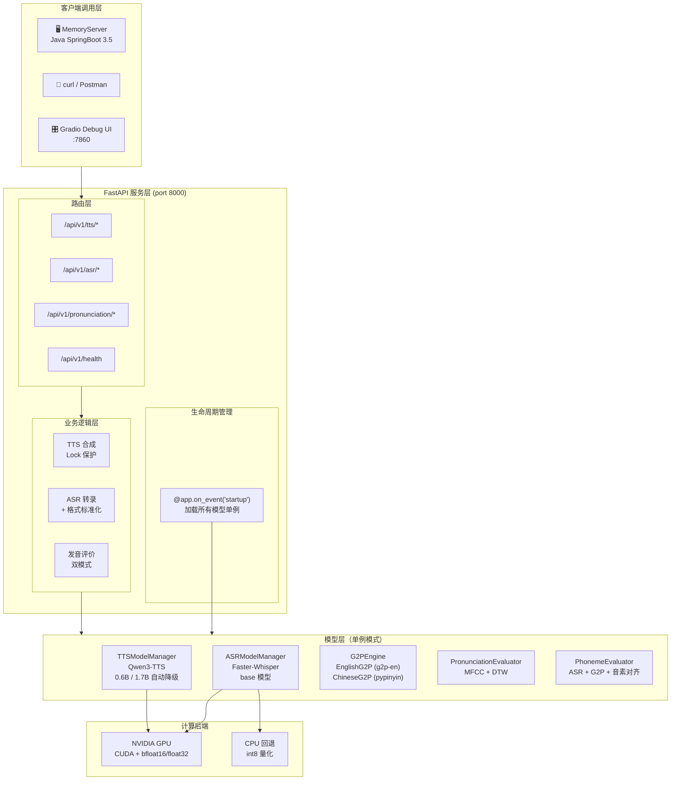

### 2.2 技术栈详解

| 层级 | 技术 | 版本 | 用途 | 选型理由 |
|------|------|------|------|---------|
| **Web 框架** | FastAPI | latest | REST API + WebSocket | 高性能异步框架，原生 OpenAPI 文档，类型安全 |
| **ASGI 服务器** | Uvicorn | latest | 运行 FastAPI，热重载 | 轻量高速，支持 `--reload` 开发模式 |
| **TTS 引擎** | Qwen3-TTS (`qwen_tts`) | latest | 多语言语音合成 | 阿里通义千问 3 代，9 个预设音色，情感指令控制 |
| **ASR 引擎** | Faster-Whisper | latest | 语音转录 + 语言检测 | Whisper 的 CTranslate2 加速版，推理速度提升 4 倍 |
| **深度学习框架** | PyTorch | 2.7.0+cu128 | GPU 推理 | CUDA 12.8，bfloat16 加速 |
| **Transformers** | HuggingFace Transformers | 4.57.3 | 模型加载基座 | Qwen3-TTS 依赖 |
| **英文 G2P** | `g2p-en` | latest | 英文文字→音素（ARPAbet） | 基于 CMU Pronouncing Dictionary + NLTK POS tagger |
| **中文 G2P** | `pypinyin` | latest | 中文文字→拼音声韵母 | 支持声调，声母韵母智能拆分 |
| **音频处理** | `librosa` | latest | MFCC 特征提取、音频加载 | 经典的音频分析库 |
| **音频 I/O** | `soundfile` | latest | WAV 读写、格式标准化 | 高效、格式兼容性好 |
| **DTW 算法** | `fastdtw` | latest | 动态时间规整 | O(N) 近似 DTW，比标准 O(N²) 快 |
| **序列比对** | `difflib` (标准库) | — | 词级/音素级编辑距离对齐 | 原生支持 equal/replace/delete/insert 四类操作 |
| **数据模型** | Pydantic | latest | 请求体校验 | FastAPI 原生支持 |
| **调试 UI** | Gradio | latest | TTS 可视化测试界面 | 快速搭建 ML 模型演示 |
| **容器化** | Docker | — | 标准化部署 | Python 3.12-slim 基础镜像 |

### 2.3 服务端-客户端联动全景

以下序列图展示了 MemoryServer（Java SpringBoot）与 MemoryServerTTS（Python FastAPI）之间在一次"AI 英语对话"中的完整交互过程：

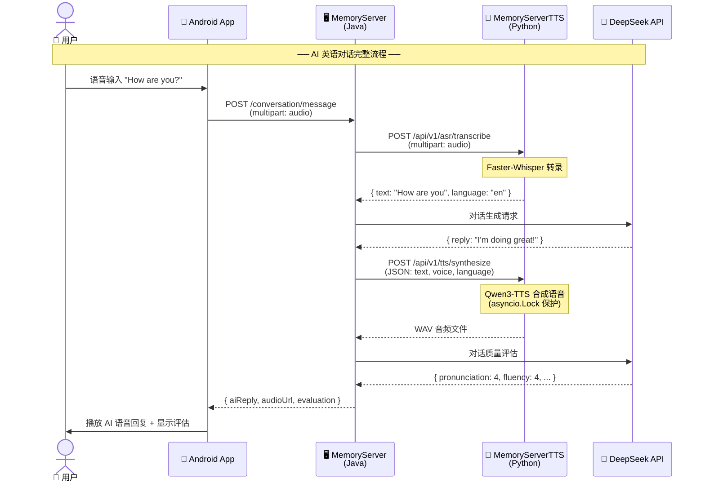

---

## 3. 环境依赖

| 组件 | 最低要求 | 推荐配置 | 说明 |
|------|---------|---------|------|
| Python | 3.10+ | 3.12 | 运行环境 |
| PyTorch | 2.0.1+ (CUDA) | 2.7.0+ (CUDA 12.8) | GPU 推理必需 |
| 显存 (0.6B 模型) | 2 GB | 4 GB | 轻量 TTS 模型 |
| 显存 (1.7B 模型) | 4 GB | 8 GB | 高质量 TTS 模型 |
| 磁盘空间 | 3 GB | 10 GB | 含两套模型文件 |
| 操作系统 | Windows / Linux / macOS | Linux (生产) | — |
| CUDA | 11.8+ | 12.8 | NVIDIA GPU 必需 |

> **Faster-Whisper 模型**：首次运行时会从 HuggingFace Hub 自动下载 `base` 模型（约 140 MB），缓存于 `~/.cache/huggingface/`。

---

## 4. 模块详解

### 4.1 TTS 模型管理器 — `src/tts/model_loader.py`

#### 设计思路

TTS 模型管理器是整个语音合成能力的核心。设计上遵循四个原则：

1. **单例模式**：Qwen3-TTS 模型加载到 GPU 显存后，每个实例占用 1-4 GB 显存，加载耗时 20-60 秒。单例确保全局只有一个模型实例，避免显存爆炸和重复加载。
2. **主备降级（1.7B 优先）**：默认加载 **1.7B 主模型**（质量好、支持 `instruct`），本地缺失或加载失败时降级到 **0.6B 备选模型**（轻量，但不支持 `instruct`）。⚠️ 注意：早期版本为"0.6B 优先"，2026-08 已反转。
3. **计算精度自适应**：根据 GPU 架构自动选择 `bfloat16`（Ampere SM 8.0+，如 RTX 30xx/A100/H100）或 `float32`（旧架构/CPU）。
4. **短/长文本分治**（2026-08 起）：单词语音走"确定性解码 + ASR 校验闭环"，短句/长文本走"随机采样 + 轻量时长校验"，详见 4.1.1。

#### 单例模式实现原理

```python
class TTSModelManager:
    _instance = None  # 类变量，保存唯一实例

    def __new__(cls, config=None):
        if cls._instance is None:           # 首次调用
            cls._instance = super().__new__(cls)  # 调用 object.__new__
            cls._instance._config = config or TTSConfig()  # 注入配置
            cls._instance._load_model()     # 加载模型
        return cls._instance                # 后续调用直接返回已有实例
```

**关键点**：Python 的 `__new__` 方法在 `__init__` 之前调用，负责创建实例。通过重写 `__new__` 实现单例，确保无论如何调用 `TTSModelManager()`，返回的都是同一个实例。

#### 主备加载策略（1.7B → 0.6B）

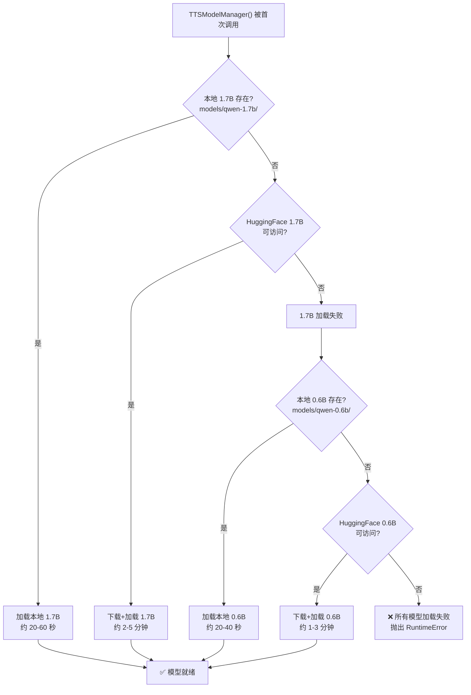

配置方式：可通过环境变量覆盖默认路径（`config/tts.yaml` 的 `tts.model_path` 亦生效）

| 环境变量 | 默认值 | 说明 |
|---------|--------|------|
| `QWEN_TTS_MODEL_PATH` | `./models/qwen-1.7b`（或 yaml `tts.model_path`） | 主模型本地路径 |
| `QWEN_TTS_MODEL` | `Qwen/Qwen3-TTS-12Hz-1.7B-CustomVoice` | 主模型 HF ID |
| `TTSCONF_MODEL_PATH` | 同 `QWEN_TTS_MODEL_PATH` | TTSConfig 环境变量覆盖（词库 CLI 用它强制 1.7B） |

> ⚠️ **0.6B 模型不支持 `instruct`**：qwen_tts 包会在 0.6B 上静默丢弃指令。听写词库预生成（`src/dictation/pregenerate.py`）通过 `TTSCONF_MODEL_PATH` **强制 1.7B**，规避该限制。

#### GPU 精度自适应原理

```python
caps = torch.cuda.get_device_capability()
supports_bf16 = caps[0] >= 8  # Ampere (SM 8.0+) 支持 bfloat16
compute_dtype = torch.bfloat16 if (use_gpu and supports_bf16) else torch.float32
```

- **NVIDIA 计算能力（Compute Capability）** 是一个版本号 `major.minor`，`get_device_capability()` 返回 `(major, minor)`
- **SM 8.0** = Ampere 架构（RTX 3090, A100, A6000），**SM 8.6** = RTX 3060/3070/3080，**SM 8.9** = RTX 4060/4070/4080/4090
- **SM 9.0** = Hopper 架构（H100）
- `bfloat16`（Brain Floating Point）是一种 16 位浮点格式，与 float32 有相同的指数范围（8 位），但尾数只有 7 位。相比 float16，bfloat16 不容易溢出/下溢，适合深度学习推理
- 旧架构（如 GTX 10xx 的 SM 6.1、RTX 20xx 的 SM 7.5）不支持 bfloat16 硬件加速，回退到 float32
- `torch.set_float32_matmul_precision('high')` 全局开启 TF32 加速（Ampere+，精度损失 <0.1%，速度提升 ~20%）

#### 注意力实现选择

```python
"attn_implementation": "sdpa"
```

固定使用 PyTorch 原生的 **Scaled Dot-Product Attention (SDPA)**，避免对 `flash-attn` 的额外依赖。SDPA 是 PyTorch 2.0+ 内置的融合注意力算子，自动选择最优实现（FlashAttention、Memory-Efficient Attention 或朴素实现）。

#### 关键 API

```python
def generate(self, text: str, voice: str = "", language: str = "",
             instructions: str = "", streaming: bool = False,
             verify: bool | None = None, seed: int | None = None
             ) -> tuple[list[np.ndarray], int, dict]:
```

| 参数 | 类型 | 默认值 | 说明 |
|------|------|--------|------|
| `text` | str | — | 待合成文本 |
| `voice` | str | `""` | 音色 ID；留空按语言自动匹配母语音色（English→aiden） |
| `language` | str | `"English"` | 语言（`"Chinese"`, `"English"` 等，兼容 `en`/`zh` 简写） |
| `instructions` | str | `""` | 情感/风格指令（**业务侧传入，服务端不注入**，见 CONSTRAINTS.md C1） |
| `streaming` | bool | `False` | `True`=流式模式（不做校验） |
| `verify` | bool\|None | `None` | `None`=自动（仅单词语音校验）；`true`=强制（仅单词语音生效）；`false`=跳过 ASR 校验 |
| `seed` | int\|None | `None` | 基础随机种子（单词语音重试时 `seed+i`） |

**返回值**：`(wavs, sample_rate, meta)` — `meta` 含 `verified / attempts / asr_text / confidence / duration / strategy(short|long) / seed / details`。

#### 4.1.1 短/长文本分治与单词语音校验闭环（2026-08 起）

`generate()` 依据 `is_single_word()`（`src/tts/model_loader.py`）判定输入类型：

| 输入类型 | 判定 | 解码策略 | 校验 |
|---------|------|---------|------|
| 单词语音（`ahead`/`well`/`你好`） | 剥尾标点后 1 词、无内部空白、长度 ≤ 40 | 确定性：temp 0.5 / top_k 20 / top_p 0.9 / rep 1.2 / max_new 512 / 固定 seed | ASR 回读校验 + 换 seed 重试（≤3 次） |
| 短句/多词短语（`How are you?` 等） | 非单词 | 随机采样（temp 0.9 / max_new 2048） | 轻量时长校验 + 重试 1 次 |
| 长文本（>250 字符） | 非单词 | 分句后逐块随机采样 | 逐块轻量时长校验 |

校验细节（宽松匹配 + 置信度门槛、失败降级语义）见 `docs/API_DOCUMENTATION.md` 4.4 节与 `docs/CONSTRAINTS.md` G 组约束。

---

### 4.2 ASR 模型管理器 — `src/asr/model_loader.py`

#### 设计思路

ASR 模型管理器封装了 Faster-Whisper 的加载和转录调用。与 TTS 管理器一样采用**单例模式**，同时针对不同硬件环境自动选择计算精度。

#### Faster-Whisper 原理

Faster-Whisper 是 OpenAI Whisper 模型的 **CTranslate2 重实现**，核心优化手段：

| 优化技术 | 说明 | 加速效果 |
|---------|------|---------|
| **CTranslate2 推理引擎** | 针对 Transformer 模型的专用推理框架 | 主要加速来源 |
| **INT8 量化（CPU）** | 将权重和激活值量化为 8 位整数 | CPU 上提速 2-3 倍 |
| **FP16 推理（GPU）** | 使用半精度浮点计算 | GPU 上提速 1.5-2 倍 |
| **算子融合** | 合并多个连续操作为单个 CUDA kernel | 减少显存带宽压力 |
| **KV Cache 优化** | 重用已计算的 Key/Value 矩阵 | 解码阶段加速 |

**Whisper 模型架构**：基于 Encoder-Decoder Transformer：

```
音频 → Log-Mel 频谱图 → Encoder (多层 Transformer) → 隐藏表示
                                                          ↓
文本 ← 自回归解码 ← Decoder (多层 Transformer + Cross-Attention)
```

#### 模型尺寸对比

| 模型 | 参数量 | 显存需求 | 英文 WER | 多语言 WER | 推理速度 |
|------|--------|---------|----------|-----------|---------|
| `tiny` | 39M | ~1 GB | 7.5% | 17.2% | 最快 |
| `base` | 74M | ~1.5 GB | 5.5% | 13.9% | 快 |
| `small` | 244M | ~2.5 GB | 4.1% | 11.2% | 中等 |
| `medium` | 769M | ~5 GB | 3.4% | 9.0% | 较慢 |
| `large-v3` | 1.55B | ~10 GB | 2.7% | 7.5% | 最慢 |

#### 计算类型自适应

```python
device = "cuda" if torch.cuda.is_available() else "cpu"
compute_type = "float16" if device == "cuda" else "int8"
```

- GPU 上使用 `float16` 充分利用 Tensor Core
- CPU 上使用 `int8` 量化减少内存和计算量

#### 关键 API

```python
def transcribe(self, audio_path: str, language: str = "",
               task: str = "transcribe", beam_size: int = 5,
               word_timestamps: bool = False) -> dict:
```

| 参数 | 类型 | 默认值 | 说明 |
|------|------|--------|------|
| `audio_path` | str | — | 音频文件路径 |
| `language` | str | `""`（自动检测） | 语言代码，如 `"en"`, `"zh"`, `"ja"` |
| `task` | str | `"transcribe"` | `"transcribe"` 转录 / `"translate"` 翻译为英文 |
| `beam_size` | int | `5` | 束搜索宽度，越大越准但越慢 |
| `word_timestamps` | bool | `False` | 是否返回单词级时间戳 |

**返回值结构**：

```python
{
    "text": "Hello world",           # 完整转录文本
    "language": "en",                # 检测到的语言代码
    "language_probability": 0.95,    # 语言检测置信度
    "segments": [                    # 分段结果
        {
            "id": 0,
            "start": 0.0,            # 该段起始时间（秒）
            "end": 2.5,              # 该段结束时间（秒）
            "text": "Hello world",   # 该段文本
            "confidence": -0.12,     # 平均对数概率
            "words": [...]           # 单词级时间戳（仅 word_timestamps=True）
        }
    ]
}
```

---

### 4.3 发音评价器（MFCC+DTW）— `src/pronunciation/evaluator.py`

#### 设计思路

这是最初的发音评价方案，通过对比学生录音和标准参考录音的**声学特征相似度**来打分。它不需要理解语言内容，只关心"听起来像不像"。

#### 算法原理

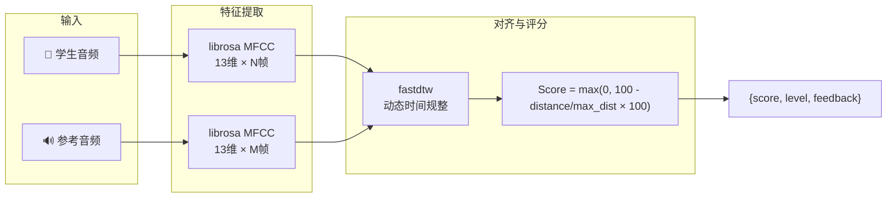

#### MFCC 特征提取

**MFCC（Mel-Frequency Cepstral Coefficients，梅尔频率倒谱系数）** 是语音识别中最经典的声学特征。提取过程：

1. **预加重**：$y[n] = x[n] - 0.97 \cdot x[n-1]$，增强高频分量
2. **分帧**：25ms 窗口 + 10ms 步长
3. **加窗（汉明窗）**：减少频谱泄露
4. **FFT**：将时域信号转到频域
5. **Mel 滤波器组**：将线性频率映射到 Mel 尺度（人耳感知的非线性频率尺度）
   $$mel(f) = 2595 \cdot \log_{10}(1 + f/700)$$
6. **对数运算**：$\log$ 压缩动态范围
7. **DCT（离散余弦变换）**：去相关，取前 13 个系数

**为什么是 13 维？** 13 是语音识别领域经过大量实验验证的最优值——足够捕获声道形状信息，又不至于包含过多无关变化。

#### DTW 动态时间规整

**问题**：两个人读同一个词，时长往往不同（例如 "hello" 可能 0.3 秒 vs 0.5 秒）。直接用欧氏距离比较 MFCC 序列是不公平的。

**DTW 解决思路**：寻找两条序列之间的最优对齐路径，允许时间轴上的非线性拉伸/压缩。

```
学生:  [a1, a2, a3, a4, a5]         (5 帧)
参考:  [b1, b2, b3]                 (3 帧)

DTW 对齐（示例）:
  a1 → b1
  a2 → b1   ← 拉伸
  a3 → b2
  a4 → b2   ← 拉伸
  a5 → b3

累计距离 = d(a1,b1) + d(a2,b1) + d(a3,b2) + d(a4,b2) + d(a5,b3)
```

本项目使用 **fastdtw**（快速 DTW），通过 `radius` 参数限制搜索窗口（默认 `radius=1`），将复杂度从 $O(NM)$ 降到近似 $O(N)$。

#### 评分公式

$$score = \max\left(0, 100 - \frac{distance}{max\_distance} \times 100\right)$$

其中 `max_distance = 1000` 是归一化参数。DTW 距离越小，说明两条音频的声学特征越接近，评分越高。

#### 局限性

- **需要参考音频**，使用场景受限
- **无法定位具体错误**，只能给整体分数
- **对背景噪声敏感**

这些局限性促使了后续 **G2P+ASR 音素评价器**（第 4.5 节）的开发。

---

### 4.4 G2P 引擎 — `src/pronunciation/g2p_engine.py`

#### 设计思路

G2P（Grapheme-to-Phoneme，字形到音素转换）是音素级发音评价的前置基础。它负责将书写的文字（Grapheme）转化为发音的音素序列（Phoneme），是连接"文字"和"声音"的桥梁。

设计采用 **策略模式（Strategy Pattern）**：定义抽象基类 `G2PEngine`，英文和中文各有一个具体实现，通过工厂函数 `get_g2p_engine()` 按语言动态选择。

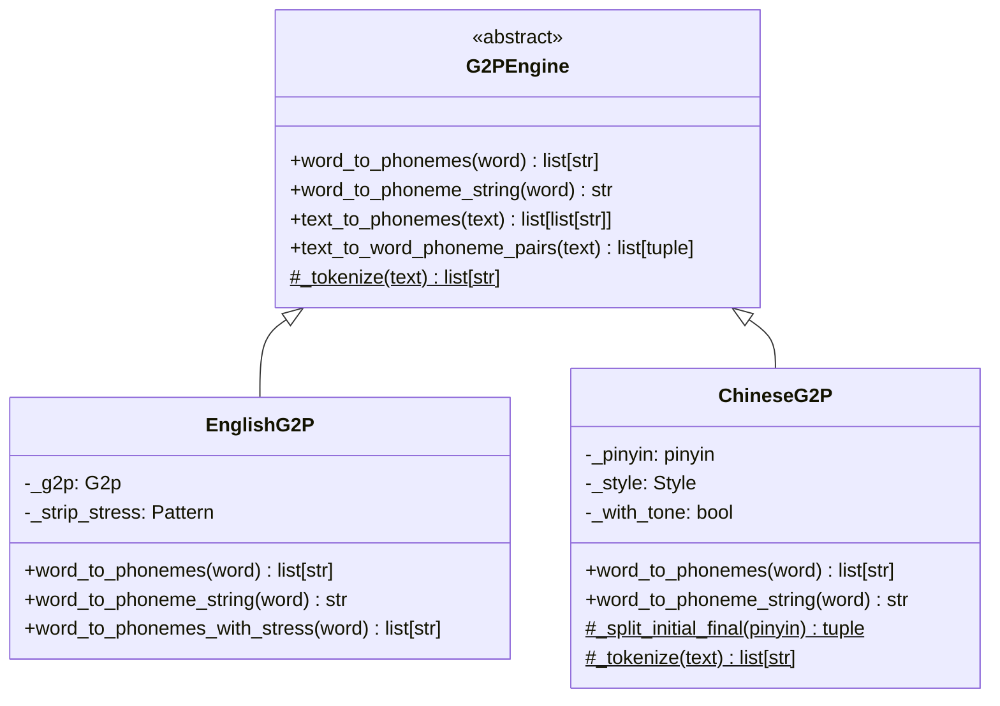

#### 英文 G2P：基于 g2p-en + ARPAbet

**ARPAbet** 是 CMU 发音词典使用的音素集，共 39 个音素：

| 类别 | 音素 | 示例 |
|------|------|------|
| 元音 | AA, AE, AH, AO, AW, AY, EH, ER, EY, IH, IY, OW, OY, UH, UW | AA = f**a**ther, IY = b**ea**t |
| 塞音 | B, D, G, K, P, T | P = **p**en |
| 擦音 | DH, F, S, SH, TH, V, Z, ZH | DH = **th**is, TH = **th**in |
| 塞擦音 | CH, JH | CH = **ch**in |
| 鼻音 | M, N, NG | NG = si**ng** |
| 流音/滑音 | HH, L, R, W, Y | L = **l**ight |

**去重音处理**：`g2p-en` 输出的 ARPAbet 带重音标记（`AH0`, `AH1`, `AH2`），音素比对时通过正则 `[0-2]$` 去除：

```python
# "hello" → ['HH', 'AH0', 'L', 'OW1'] 
# 去重音后 → ['HH', 'AH', 'L', 'OW']
self._strip_stress = re.compile(r'[0-2]$')
return [self._strip_stress.sub('', p) for p in raw]
```

#### 中文 G2P：基于 pypinyin + 声韵母拆分

中文没有标准音素集，使用拼音的声母+韵母作为"音素"的近似替代。

**声韵母拆分算法**：

```python
def _split_initial_final(pinyin: str) -> tuple[str, str]:
    initials = ['zh', 'ch', 'sh',  # 翘舌音优先（长前缀匹配）
                'b', 'p', 'm', 'f', 'd', 't', 'n', 'l',
                'g', 'k', 'h', 'j', 'q', 'x',
                'z', 'c', 's', 'r', 'y', 'w']
    for init in initials:
        if pinyin.startswith(init):
            return init, pinyin[len(init):]
    return '', pinyin
```

示例：
| 汉字 | 拼音 | 声母 | 韵母 |
|------|------|------|------|
| 我 | wo3 | w | o3 |
| 学 | xue2 | x | ue2 |
| 中 | zhong1 | zh | ong1 |

**优先级设计**：`zh/ch/sh` 必须在 `z/c/s` 之前匹配，因为 `zhong1` 如果先匹配 `z` 会错误拆成 `z` + `hong1`。

#### 工厂函数

```python
def get_g2p_engine(language: str) -> G2PEngine:
    lang_lower = language.lower() if language else "en"
    if lang_lower in ("en", "english", "eng"):
        return EnglishG2P()
    elif lang_lower in ("zh", "chinese", "chi", "cn", "mandarin"):
        return ChineseG2P()
    else:
        return EnglishG2P()  # 默认回退英文
```

---

### 4.5 音素发音评价器 — `src/pronunciation/phoneme_evaluator.py`

这是本项目的**核心创新模块**，也是发音评价的推荐方案。

#### 设计思路

与 MFCC+DTW 评价器的核心区别在于：**不再依赖标准参考音频，只需要参考文本**。通过 ASR 理解学生说了什么，再用 G2P 将文字转为音素，在"音素语义层"做比对。

这个设计使得发音评价能够：
- **精准定位**错误：不仅知道分数低，还知道"哪个词的哪个音素读错了"
- **区分错误类型**：音素替换？遗漏？多读了不该读的音？
- **给出教学建议**：告诉学生具体该练习什么

#### 两种评价器对比

| 维度 | MFCC+DTW 评价器 | 音素评价器（推荐） |
|------|----------------|-------------------|
| 参考输入 | 需要标准参考音频 | 仅需参考文本 ✅ |
| 评价粒度 | 整体评分 | 逐词、逐音素 ✅ |
| 错误类型 | 无 | 替换/遗漏/插入 ✅ |
| 语义理解 | 无（纯声学对比） | 有（结合 ASR 文本）✅ |
| 噪声敏感度 | 高 | 低（Whisper 鲁棒性强）✅ |
| 适用场景 | 跟读对比 | 自由发音、口语考试 |

#### 完整评价流程

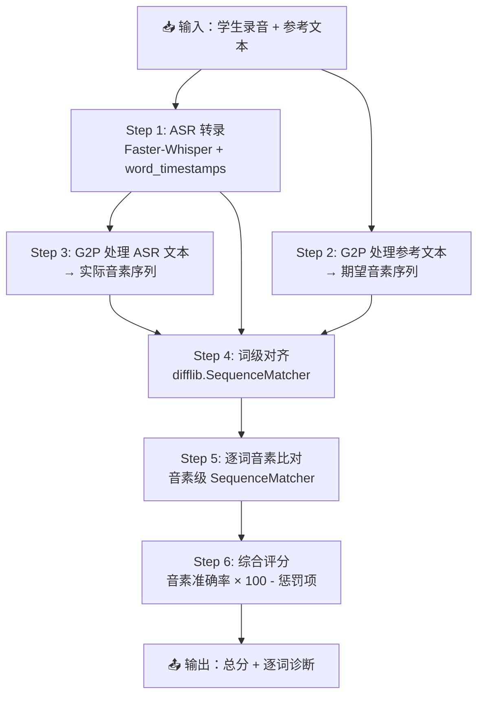

#### Step 1：ASR 转录（带单词时间戳）

调用 `ASRModelManager.transcribe()`，必须开启 `word_timestamps=True`：

```python
asr_result = self.asr_model.transcribe(
    audio_path=audio_path,
    word_timestamps=True,     # 必需：用于后续对齐
    language=language,        # 透传给 Faster-Whisper
)
```

**为什么需要单词时间戳？** 一方面用于输出中标注每个词的起止时间；另一方面如果未来扩展到"音节/音素级时间对齐"，单词时间戳是基础。

#### Step 2-3：双路 G2P 转换

```python
# 参考文本 → [(word, [phonemes]), ...]
ref_word_phonemes = g2p.text_to_word_phoneme_pairs(reference_text)
# 例如 "hello world" → [("hello", ["HH","AH","L","OW"]), ("world", ["W","ER","L","D"])]

# ASR 文本 → [(word, [phonemes]), ...]  
asr_word_phonemes = g2p.text_to_word_phoneme_pairs(spoken_text)
```

#### Step 4：词级对齐（SequenceMatcher）

使用 Python 标准库 `difflib.SequenceMatcher`，将参考文本的单词序列与 ASR 输出的单词序列对齐：

```python
ref_words = [item[0] for item in ref_word_phonemes]   # ["hello", "world"]
asr_words = [item[0] for item in asr_word_phonemes]   # ["hello", "word"]

matcher = difflib.SequenceMatcher(None, ref_words, asr_words)
opcodes = matcher.get_opcodes()
# 返回: [("equal", 0,1,0,1), ("replace", 1,2,1,2)]
#      → "hello" 匹配 "hello", "world" 替换为 "word"
```

**SequenceMatcher 的优势**：直接返回 `equal/replace/delete/insert` 四种操作类型的结构化结果，天然映射为 `correct/mispronounced/missing/extra` 四种评价状态。

#### Step 5：逐词音素比对

对每个对齐的词对，再次使用 `SequenceMatcher` 进行音素级比对：

```python
ref_phons = ["L", "ER", "N", "IH", "NG"]     # "Learning" 的期望音素
asr_phons = ["L", "AH", "N", "IH", "NG"]     # 学生实际发的音

matcher = difflib.SequenceMatcher(None, ref_phons, asr_phons)
# → [("equal", 0,1,0,1), ("replace", 1,2,1,2), ("equal", 2,5,2,5)]
# → 音素"ER"被替换为"AH"（substitution 错误）
```

三类错误：
| 错误类型 | opcode | 含义 | 示例 |
|---------|--------|------|------|
| `substitution` | replace | 音素被其他音素替换 | /ER/ → /AH/ |
| `deletion` | delete | 音素被遗漏 | "and" 读成 "an"（漏了 /D/） |
| `insertion` | insert | 多读了额外音素 | "cat" 读成 "cater"（多了 /ER/） |

#### Step 6：综合评分

```python
# 基础分 = 音素准确率 × 100
base_score = phoneme_accuracy * 100

# 缺失词惩罚：每个没读的词扣 (20 / 总词数)
missing_penalty = (missing_count / ref_word_count) * 20

# 多余词惩罚：最多扣 10 分
extra_penalty = min(extra_count * 2, 10)

overall_score = max(0, base_score - missing_penalty - extra_penalty)
```

**评分哲学**：惩罚设计反映了教学优先级——遗漏单词比读错单词更严重（说明学生根本没开口），所以缺失惩罚权重更大。

#### 输出结构

```python
{
    "overall_score": 85.3,           # 综合评分 0-100
    "phoneme_accuracy": 0.875,       # 音素准确率
    "word_count_reference": 5,       # 参考词数
    "word_count_spoken": 5,          # 实际词数
    "asr_transcript": "hello world", # ASR 转录文本
    "level": "good",                 # 等级
    "feedback": "发音良好。需重点练习的词汇：world",
    "words": [{
        "word": "world",
        "spoken_word": "world",
        "score": 75.0,
        "expected_phonemes": ["W", "ER", "L", "D"],
        "actual_phonemes": ["W", "ER", "L"],
        "phoneme_accuracy": 0.75,
        "errors": [
            {"type": "deletion", "expected": "D", "actual": None, "position": 3}
        ],
        "status": "mispronounced"
    }]
}
```

#### 与 MemoryServer 发音纠正模块的联动

在 MemoryServer 中，`PronunciationService` 调用本接口实现完整的发音纠正流程：

```
Android 录音 → MemoryServer PronunciationService
    → HTTP multipart POST → MemoryServerTTS phoneme-score
    → 返回逐词/逐音素诊断
    → MemoryServer 解析结果，封装为客户端友好的格式
    → Android 展示：总分、每个词的发音状况、具体音素错误
```

这使得 Android 客户端可以做到：
- 高亮显示发音有问题的单词（红色=错误，黄色=有瑕疵，绿色=完美）
- 点击单词查看具体的音素错误详情
- 播放标准 TTS 发音进行对比

---

### 4.6 FastAPI 主服务 — `server.py`

#### 设计思路

`server.py` 是整个服务的编排层，负责：
1. **生命周期管理**：启动时加载所有模型，确保服务就绪后才接受请求
2. **路由分发**：将 HTTP 请求路由到对应的处理器
3. **并发控制**：通过 `asyncio.Lock` 序列化 TTS GPU 推理请求
4. **安全处理**：音频文件上传的多重校验和格式标准化

#### 启动生命周期

```python
@app.on_event("startup")
async def startup_event():
    app.state.tts_config = TTSConfig()              # TTS 配置（解码/校验/词库缓存参数）
    app.state.model = TTSModelManager(config=app.state.tts_config)   # 加载 TTS 模型 (~20-60s)
    app.state.asr_model = ASRModelManager()          # 加载 ASR 模型 (~5-10s)
    app.state.pronunciation_evaluator = PronunciationEvaluator()  # 初始化 MFCC 评价器
    app.state.phoneme_evaluator = PhonemeEvaluator(app.state.asr_model)  # 初始化音素评价器（注入 ASR 依赖）
    app.state.ocr_engine = OCREngine(...)            # 初始化 OCR 引擎
```

**启动顺序**：TTS（最耗时）→ ASR → 评价器 → OCR。所有模型作为 `app.state` 属性存储，依赖注入到路由函数中。

**挂载的路由**：`tts` / `asr` / `pronunciation` / `ocr` / `dictation`（词库缓存）/ `dashboard`（管理后台），另挂载 `/tts-audio` 静态目录（`/stream` 与 `include_meta` 返回的 `audioUrl` 依赖它）。

#### 并发控制：asyncio.Lock

```python
app.state.model_lock = asyncio.Lock()

# 所有 TTS 生成操作必须获取锁（含词库生成/校验，见 CONSTRAINTS.md P1）
async with app.state.model_lock:
    wavs, sr, meta = model.generate(...)
```

**为什么需要锁？** Qwen3-TTS 模型的 `generate_custom_voice()` 方法不是线程安全/协程安全的。并发调用会导致 GPU 显存竞争，产生如下问题：
- 两个请求的文本混在一起输出
- 显存溢出（OOM）
- CUDA 错误

`asyncio.Lock` 确保同一时刻只有一个 TTS 请求在 GPU 上推理，其他请求排队等待。由于 TTS 推理本身很快（通常 1-5 秒），锁的排队延迟在可接受范围内。**注意**：单词语音校验闭环（ASR 回读）也在锁内执行，听写请求延迟增加约 0.5-1.5s。

#### 音频安全处理五步流程

所有接收音频文件的接口都执行以下安全处理：

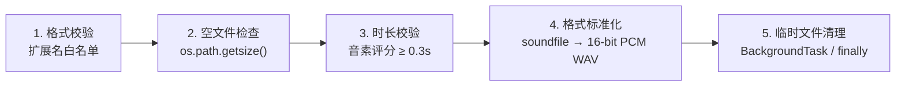

**格式标准化原理**：使用 `soundfile` 将任意支持的格式（WAV/MP3/FLAC/M4A）重编码为 16-bit PCM WAV，原因：
- Faster-Whisper 对某些编码格式兼容性不佳
- 统一格式避免后续处理链的格式问题
- 16-bit PCM 是最通用的无损格式

#### snake_case → camelCase 转换

音素评价接口的输出自动转换为 camelCase，方便 Java/JavaScript 客户端使用：

```python
def _snake_to_camel(data):
    if isinstance(data, dict):
        return {_to_camel(k): _snake_to_camel(v) for k, v in data.items()}
    if isinstance(data, list):
        return [_snake_to_camel(item) for item in data]
    return data
```

例如：`overall_score` → `overallScore`，`phoneme_accuracy` → `phonemeAccuracy`

#### 完整端点清单

| 方法 | 路径 | 请求格式 | 响应格式 | 锁保护 |
|------|------|---------|---------|--------|
| `GET` | `/api/v1/health` | — | JSON | — |
| `GET` | `/api/v1/tts/voices` | — | JSON | — |
| `POST` | `/api/v1/tts/synthesize` | JSON | audio/wav | ✅ |
| `WebSocket` | `/api/v1/tts/stream` | JSON 消息帧 | JSON 音频帧 | ✅ |
| `POST` | `/api/v1/tts/clone` | multipart | JSON | — |
| `POST` | `/api/v1/asr/transcribe` | multipart | JSON | — |
| `GET` | `/api/v1/asr/models` | — | JSON | — |
| `POST` | `/api/v1/pronunciation/score` | multipart (2 files) | JSON | — |
| `POST` | `/api/v1/pronunciation/batch-score` | JSON | JSON | — |
| `POST` | `/api/v1/pronunciation/phoneme-score` | multipart | JSON (camelCase) | — |
| `POST` | `/api/v1/pronunciation/phoneme-score-with-text` | multipart | JSON (camelCase) | — |
| `POST` | `/api/v1/pronunciation/phoneme-batch-score` | JSON | JSON | — |

---

### 4.7 调试与测试工具

#### 管理后台（`/admin`）

浏览器访问 `http://localhost:8000/admin`，集成各模块调试面板（单页 tab 结构）：

- **系统概览**：GPU/显存状态、模型加载状态
- **TTS 合成 / ASR 识别 / 发音评价 / OCR 扫描**：各模块功能调试与测速
- 🔥 **词库管理**：听写词库缓存统计、批量预生成（任务进度轮询）、词条表格（试听 / 标记 bad / 重新生成）
- **测速工作台**：TTS/ASR/OCR 响应延迟基准

#### 单元测试（`tests/`）

```bash
# 全量测试（约 6 秒，无需 GPU）
python -m unittest discover -s tests -p "test_*.py"

# 单模块
python -m unittest tests.test_tts_verifier tests.test_dictation_cache tests.test_tts_model_loader -v
```

| 测试文件 | 覆盖内容 |
|---------|---------|
| `test_tts_verifier.py` | ASR 校验宽松匹配（分词/前缀/编辑距离）、置信度门槛、语言映射 |
| `test_dictation_cache.py` | 缓存 key 稳定性/区分度/配置变更失效、原子写入、bad 标记、评分与 best-of-N 择优 |
| `test_tts_model_loader.py` | 单词语音判定 `is_single_word`（含短句排除） |
| `test_official.py` | Qwen3-TTS 官方接口连通性（需 GPU + 模型） |

#### 官方测试脚本（`tests/test_official.py`）

用于直接测试 Qwen3-TTS 官方 API，验证模型是否正确安装：

```bash
python tests/test_official.py
```

执行流程：
1. 检查 CUDA 是否可用
2. 加载 1.7B 模型（优先本地，回退 HuggingFace）
3. 生成一句英文测试语音
4. 保存为 `test_emotion_output.wav`

#### 词库预生成 CLI（`src/dictation/pregenerate.py`）

```bash
python -m src.dictation.pregenerate --words ahead,behind,cat
python -m src.dictation.pregenerate --file words.csv --best-of 5
```

强制 1.7B、best-of-N 择优、ASR 校验后入库（详见 API 文档 4.5.3）。
---

## 5. API 接口详解

### 5.1 接口总览

基础 URL：`http://<server-ip>:8000`

所有接口统一前缀 `/api/v1/`。

| # | 方法 | 路径 | 说明 | 请求类型 | 响应类型 |
|---|------|------|------|---------|---------|
| 1 | `GET` | `/api/v1/health` | 健康检查 | — | JSON |
| 2 | `GET` | `/api/v1/tts/voices` | 音色列表 | — | JSON |
| 3 | `POST` | `/api/v1/tts/synthesize` | 文本合成 WAV | JSON | binary/WAV |
| 4 | `WS` | `/api/v1/tts/stream` | 流式合成 | WebSocket JSON | WebSocket JSON |
| 5 | `POST` | `/api/v1/tts/clone` | 音色克隆(模拟) | multipart | JSON |
| 6 | `POST` | `/api/v1/asr/transcribe` | 语音转录 | multipart | JSON |
| 7 | `GET` | `/api/v1/asr/models` | ASR 模型列表 | — | JSON |
| 8 | `POST` | `/api/v1/pronunciation/score` | MFCC+DTW 评分 | multipart | JSON |
| 9 | `POST` | `/api/v1/pronunciation/batch-score` | 批量 MFCC 评分 | JSON | JSON |
| 10 | `POST` | `/api/v1/pronunciation/phoneme-score` | 🔥 音素评分 | multipart | JSON (camelCase) |
| 11 | `POST` | `/api/v1/pronunciation/phoneme-score-with-text` | 音素评分(别名) | multipart | JSON (camelCase) |
| 12 | `POST` | `/api/v1/pronunciation/phoneme-batch-score` | 批量音素评分 | JSON | JSON |

---

### 5.2 TTS 语音合成

#### 5.2.1 合成语音（REST）

`POST /api/v1/tts/synthesize`

将文本合成为语音，返回 WAV 格式的音频二进制流。

**请求体 (JSON)**：

```json
{
  "text": "Hello, welcome to Memory English Learning App!",
  "voice": "aiden",
  "language": "English",
  "instructions": "Speak with a happy and encouraging tone.",
  "output_format": "wav"
}
```

| 字段 | 类型 | 必填 | 默认值 | 说明 |
|------|------|------|--------|------|
| `text` | string | ✅ | — | 要合成的文本，支持中英文混合 |
| `voice` | string | ❌ | `""`（自动） | 音色 ID（见下方音色表）；留空按语言自动匹配母语音色（English→aiden） |
| `language` | string | ❌ | `"English"` | 语言：`"Chinese"`, `"English"`, `"Japanese"`, `"Korean"` 等，兼容 `en`/`zh` 简写 |
| `instructions` | string | ❌ | `null` | 情感/风格指令，如 `"Speak sadly"`, `"Whisper softly"`（业务侧传入，服务端不注入） |
| `output_format` | string | ❌ | `"wav"` | 输出格式，当前仅支持 `"wav"` |
| `verify` | bool\|null | ❌ | `null` | `null`=自动（仅单词语音走 ASR 校验闭环）；`true`=强制（仅对单词语音生效）；`false`=跳过 ASR 校验 |
| `seed` | int\|null | ❌ | `null` | 基础随机种子（单词语音重试时 `seed+i`） |
| `include_meta` | bool | ❌ | `false` | `true` 返回 JSON（含 verified/attempts/asrText），否则返回 WAV 流（校验信息在 `X-TTS-*` 响应头） |

**成功响应**：

- 状态码：`200 OK`
- Content-Type：`audio/wav`
- 响应体：二进制 WAV 音频数据
- 文件名：`tts_<32位hex>.wav`
- 响应头：`X-TTS-Verified` / `X-TTS-Attempts` / `X-TTS-Strategy` / `X-TTS-Duration` / `X-TTS-Asr-Text` / `X-TTS-Asr-Confidence`

**错误响应**：

```json
{ "detail": "Only wav output is supported currently." }
```

**音色速查表**（与模型 README 官方清单一致）：

| 音色 ID | 母语 | 性别 | 风格描述 |
|---------|------|------|---------|
| `ryan` | 英文 | 男 | 富有节奏感、动感 |
| `aiden` | 英文 | 男 | 阳光、音色明亮 |
| `vivian` | 中文 | 女 | 明亮、略带锋芒 |
| `serena` | 中文 | 女 | 温暖、温柔 |
| `uncle_fu` | 中文 | 男 | 低沉柔和，经验丰富 |
| `dylan` | 中文（北京话） | 男 | 清晰自然 |
| `eric` | 中文（四川话） | 男 | 活泼、沙哑明亮 |
| `ono_anna` | 日文 | 女 | 轻盈灵巧 |
| `sohee` | 韩文 | 女 | 情感丰富 |

> ⚠️ 音色 ID 不区分大小写（模型侧自动归一）；官方建议使用音色**母语**生成以获得最佳质量。旧文档中的 "Ono_Anna 英文男声" 为错误标注——Ono_Anna 是**日语女声**。

**SpringBoot 调用示例**：

```java
// 构建请求
JSONObject body = new JSONObject();
body.put("text", "Hello, how are you?");
body.put("voice", "aiden");
body.put("language", "English");
body.put("instructions", "Speak cheerfully.");

HttpHeaders headers = new HttpHeaders();
headers.setContentType(MediaType.APPLICATION_JSON);
HttpEntity<String> request = new HttpEntity<>(body.toString(), headers);

// 发送请求，获取 WAV 字节
ResponseEntity<byte[]> response = restTemplate.postForEntity(
    "http://localhost:8000/api/v1/tts/synthesize", request, byte[].class);
byte[] wavBytes = response.getBody();

// 保存为文件
Files.write(Paths.get("output.wav"), wavBytes);
```

**curl 示例**：

```bash
curl -X POST http://localhost:8000/api/v1/tts/synthesize \
  -H "Content-Type: application/json" \
  -d '"'"'{"text":"Hello world","voice":"aiden","language":"English"}'"'"' \
  --output output.wav
```

#### 5.2.2 流式合成（WebSocket）

`WebSocket /api/v1/tts/stream`

适用于长文本或需要低延迟首字响应的场景。通过 WebSocket 分块发送文本，服务端实时返回 PCM16 音频块。

**连接地址**：`ws://localhost:8000/api/v1/tts/stream`

**客户端 → 服务端（文本块）**：

```json
{
  "type": "text_chunk",
  "data": "Hello, welcome to Memory English Learning App!",
  "voice": "aiden",
  "language": "English",
  "instructions": "Speak with a happy tone."
}
```

| 字段 | 类型 | 必填 | 说明 |
|------|------|------|------|
| `type` | string | ✅ | 固定为 `"text_chunk"` |
| `data` | string | ✅ | 待合成文本片段 |
| `voice` | string | ❌ | 音色 ID，默认 `"aiden"`（英文） |
| `language` | string | ❌ | 语言，默认 `"English"` |
| `instructions` | string | ❌ | 情感指令 |

**客户端 → 服务端（结束信号）**：

```json
{ "type": "end" }
```

**服务端 → 客户端（音频块）**：

```json
{
  "type": "audio_chunk",
  "sample_rate": 24000,
  "format": "pcm16",
  "data": "<base64_encoded_pcm_bytes>"
}
```

| 字段 | 类型 | 说明 |
|------|------|------|
| `type` | string | `"audio_chunk"` |
| `sample_rate` | int | 采样率（Hz） |
| `format` | string | `"pcm16"`（16-bit 有符号小端序 PCM） |
| `data` | string | Base64 编码的 PCM 音频数据 |

**PCM 数据解码**（Java）：
```java
byte[] pcmBytes = Base64.getDecoder().decode(base64Data);
// PCM 16-bit 小端序 → 可保存为 WAV 或直接播放
// WAV 文件 = 44字节头部 + PCM 数据
```

**服务端 → 客户端（结束/错误）**：

```json
{ "type": "end_of_stream" }
{ "type": "error", "message": "错误描述" }
```

---

### 5.3 ASR 语音识别

#### 5.3.1 转录音频

`POST /api/v1/asr/transcribe`

将音频文件转录为文字。

**请求**：`multipart/form-data`

| 字段 | 类型 | 必填 | 默认值 | 说明 |
|------|------|------|--------|------|
| `audio` | File | ✅ | — | 音频文件（.wav/.mp3/.flac/.m4a） |
| `language` | string | ❌ | `null`（自动检测） | 语言代码：`"en"`, `"zh"`, `"ja"` 等 |
| `task` | string | ❌ | `"transcribe"` | `"transcribe"` 转录 / `"translate"` 译为英文 |
| `beam_size` | int | ❌ | `5` | 束搜索宽度 |
| `word_timestamps` | bool | ❌ | `false` | 是否返回单词级时间戳 |

**成功响应**：

```json
{
  "text": "Hello, welcome to Memory English Learning App.",
  "language": "en",
  "language_probability": 0.98,
  "segments": [
    {
      "id": 0,
      "start": 0.0,
      "end": 3.5,
      "text": " Hello, welcome to Memory English Learning App.",
      "confidence": -0.08,
      "words": [
        { "word": "Hello",   "start": 0.0, "end": 0.4, "probability": 0.99 },
        { "word": "welcome", "start": 0.5, "end": 1.1, "probability": 0.97 }
      ]
    }
  ]
}
```

| 字段 | 类型 | 说明 |
|------|------|------|
| `text` | string | 完整转录文本 |
| `language` | string | 检测到的语言代码 |
| `language_probability` | float | 语言检测置信度 |
| `segments[].start` | float | 该段起始时间（秒） |
| `segments[].end` | float | 该段结束时间（秒） |
| `segments[].confidence` | float | 平均对数概率（负值，越接近0越好） |
| `segments[].words` | array | 单词时间戳（仅 `word_timestamps=true`） |

**curl 示例**：

```bash
curl -X POST http://localhost:8000/api/v1/asr/transcribe \
  -F "audio=@recording.wav" \
  -F "language=en" \
  -F "word_timestamps=true"
```

---

### 5.4 发音评价

#### 5.4.1 MFCC+DTW 评分（需参考音频）

`POST /api/v1/pronunciation/score`

**请求**：`multipart/form-data`

| 字段 | 类型 | 必填 | 说明 |
|------|------|------|------|
| `student_audio` | File | ✅ | 学生录音（.wav/.mp3/.flac） |
| `reference_audio` | File | ✅ | 标准参考音频（同格式） |

**响应**：

```json
{
  "score": 85.3,
  "distance": 147.0,
  "max_distance": 1000,
  "level": "good",
  "feedback": "发音良好，注意个别音节的准确性"
}
```

| 字段 | 类型 | 说明 |
|------|------|------|
| `score` | float | 综合评分 0-100 |
| `distance` | float | DTW 距离值（越小越好） |
| `level` | string | `excellent`(≥90) / `good`(≥75) / `fair`(≥60) / `poor`(≥40) / `very_poor`(<40) |
| `feedback` | string | 中文反馈建议 |

#### 5.4.2 音素评分（仅需参考文本，推荐）🔥

`POST /api/v1/pronunciation/phoneme-score`

**核心优势**：不需要标准参考音频，只需参考文本。能精确定位到"哪个词的哪个音素"发错了。

**请求**：`multipart/form-data`

| 字段 | 类型 | 必填 | 默认值 | 说明 |
|------|------|------|--------|------|
| `student_audio` | File | ✅ | — | 学生录音（.wav/.mp3/.flac/.m4a），自动标准化 |
| `reference_text` | string | ✅ | — | 期望朗读的参考文本 |
| `language` | string | ❌ | `null`（英语） | `"en"` 英文 / `"zh"` 中文 |

> ⚠️ 音频要求：时长 ≥ 0.3 秒，非空非静音。上传后自动标准化为 16-bit PCM WAV。

**成功响应（camelCase 格式）**：

```json
{
  "overallScore": 85.3,
  "phonemeAccuracy": 0.92,
  "wordCountReference": 5,
  "wordCountSpoken": 5,
  "asrTranscript": "Hello, welcome to Memory English Learning App.",
  "referenceText": "Hello, welcome to Memory English Learning App.",
  "level": "good",
  "feedback": "发音良好。需重点练习的词汇：Learning",
  "words": [
    {
      "word": "Learning",
      "spokenWord": "Learning",
      "startTime": 2.0,
      "endTime": 2.8,
      "score": 75.0,
      "expectedPhonemes": ["L", "ER", "N", "IH", "NG"],
      "actualPhonemes": ["L", "AH", "N", "IH", "NG"],
      "phonemeAccuracy": 0.8,
      "errors": [
        {
          "type": "substitution",
          "expected": "ER",
          "actual": "AH",
          "position": 1
        }
      ],
      "status": "mispronounced"
    }
  ]
}
```

| 字段 | 类型 | 说明 |
|------|------|------|
| `overallScore` | float | 综合评分 0-100 |
| `phonemeAccuracy` | float | 全局音素准确率 |
| `words[].status` | string | `correct` / `mispronounced` / `missing` / `extra` |
| `words[].errors[].type` | string | `substitution` / `deletion` / `insertion` |
| `words[].errors[].expected` | string|null | 期望的音素 |
| `words[].errors[].actual` | string|null | 实际的音素 |

> ⚠️ **重要**：该接口响应字段为 camelCase（如 `overallScore`），与其他接口的 snake_case 不同。这是通过 `_snake_to_camel()` 自动转换的。

**SpringBoot 调用示例**：

```java
LinkedMultiValueMap<String, Object> body = new LinkedMultiValueMap<>();
body.add("student_audio", new FileSystemResource("recording.wav"));
body.add("reference_text", "Hello, welcome to Memory English Learning App!");
body.add("language", "en");

HttpHeaders headers = new HttpHeaders();
headers.setContentType(MediaType.MULTIPART_FORM_DATA);
HttpEntity<LinkedMultiValueMap<String, Object>> request = new HttpEntity<>(body, headers);

JSONObject result = restTemplate.postForObject(
    "http://localhost:8000/api/v1/pronunciation/phoneme-score",
    request, JSONObject.class);

double score = result.getDouble("overallScore");     // camelCase!
JSONArray words = result.getJSONArray("words");
```

**curl 示例**：

```bash
curl -X POST http://localhost:8000/api/v1/pronunciation/phoneme-score \
  -F "student_audio=@recording.wav" \
  -F "reference_text=Hello world" \
  -F "language=en"
```

---

### 5.5 系统接口

#### 5.5.1 健康检查

`GET /api/v1/health`

**响应**：

```json
{
  "status": "healthy",
  "model_loaded": true,
  "gpu_available": true,
  "gpu_utilization_percent": 15,
  "vram_used_mb": 3584.0,
  "vram_total_mb": 8192.0
}
```

> MemoryServer 的 `TTSService` 在每次调用前都会先调此接口确认服务可用。若返回 `unhealthy`，MemoryServer 会跳过 TTS 调用并使用备用方案。

#### 5.5.2 音色列表

`GET /api/v1/tts/voices`

返回所有可用音色（9 个预设 + `voices/` 目录下的克隆音色）。详见 [音色速查表](#521-合成语音rest)。

#### 5.5.3 ASR 模型列表

`GET /api/v1/asr/models`

```json
{
  "models": ["tiny", "base", "small", "medium", "large-v1", "large-v2", "large-v3", "distil-large-v2"]
}
```

---

## 6. 与 MemoryServer 的联动设计

### 6.1 架构内的位置

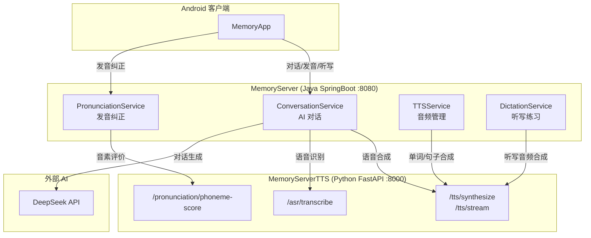

### 6.2 TTS 音频生命周期

MemoryServer 通过调用 MemoryServerTTS 的 TTS 接口获取音频，然后管理两类音频的生命周期：

| 音频类型 | TTS 端点 | MemoryServer 存储 | 生命周期 |
|---------|---------|-------------------|---------|
| 会话音频（AI 对话 TTS） | `/tts/synthesize` | `tts-audio/` 根目录 | 定时清理（默认 7 天） |
| 单词音频（学习/听写） | 🔥 `/api/v1/dictation/audio` | `word-cache/`（服务端缓存） | 永久保留，命中零生成；由管理员预生成/标记 bad/重生成 |
| 听写语境音频 | `/tts/synthesize` | `dictation_audio_cache` 表 | 30 天未访问即清理 |

> **单词音频复用（2026-08 起）**：听写单词音频改由 MemoryServerTTS 侧词库缓存提供——
> `GET /api/v1/dictation/audio?word=ahead&voice=...&language=...&instruct=...`。
> 缓存 key = hash(单词|音色|语言|instruct|gen_config_version)，命中直接返回（零生成延迟）；
> 未命中自动生成并回填；管理员通过 `/admin` "词库管理"页或 CLI（`python -m src.dictation.pregenerate`）预生成/试听/标记 bad/重生成。
> 旧方案（客户端自管 `tts-audio/words/{word}.wav`）仍可用，但不再推荐——服务端缓存自带 ASR 校验闭环与版本换代。
> `instruct` 由业务侧传入并参与缓存 key：不同情绪指令 = 不同音频条目，互不污染。

### 6.3 AI 对话中的语音链路

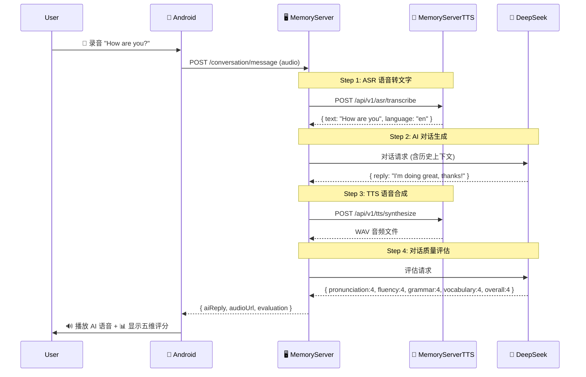

> 这个序列图中，MemoryServerTTS 提供了 Step 1（ASR）和 Step 3（TTS）两个关键能力，是整个对话流程不可替代的语音层。

### 6.4 发音纠正中的数据流

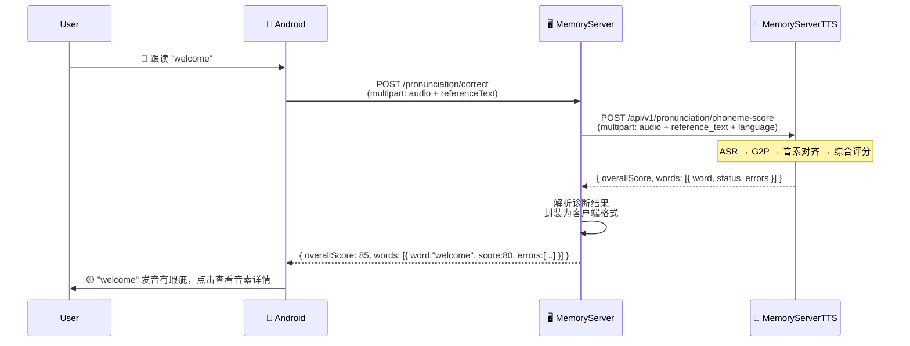

---

## 7. 配置说明

### 7.1 环境变量

| 变量名 | 默认值 | 说明 |
|--------|--------|------|
| `QWEN_TTS_MODEL_PATH` | `./models/qwen-1.7b` | 主 TTS 模型本地路径（1.7B） |
| `QWEN_TTS_MODEL` | `Qwen/Qwen3-TTS-12Hz-1.7B-CustomVoice` | 主 TTS 模型 HF ID |
| `TTSCONF_MODEL_PATH` | 同 `QWEN_TTS_MODEL_PATH` | TTSConfig 环境变量覆盖（词库 CLI 用它强制 1.7B） |
| `WHISPER_MODEL_SIZE` | `base` | Faster-Whisper 模型大小 |
| `RELOAD` | `0` | 是否启用热重载（`1`/`true` 启用） |
| `LOG_LEVEL` | `INFO` | 日志级别（`DEBUG`/`INFO`/`WARN`/`ERROR`） |
| `HF_HUB_DISABLE_SSL_VERIFY` | （未设置） | 禁用 SSL 验证（内网环境用） |

> TTSConfig 支持 `TTSCONF_<KEY>` 形式的环境变量覆盖任意 yaml 配置项（`env_prefix = "TTSCONF_"`）。

### 7.2 模型路径配置

```
models/
├── qwen-1.7b/           # 主模型（默认，~3.4 GB 显存，支持 instruct）
│   ├── model.safetensors      # 模型权重
│   ├── config.json / generation_config.json  # 模型/生成配置
│   ├── tokenizer_config.json  # 分词器配置
│   ├── vocab.json + merges.txt # 词表
│   └── speech_tokenizer/      # 语音分词器
│
└── qwen-0.6b/           # 降级备选模型（~1.2 GB 显存，不支持 instruct）
    └── ...（结构同上）
```

### 7.3 模型加载策略（1.7B 优先）

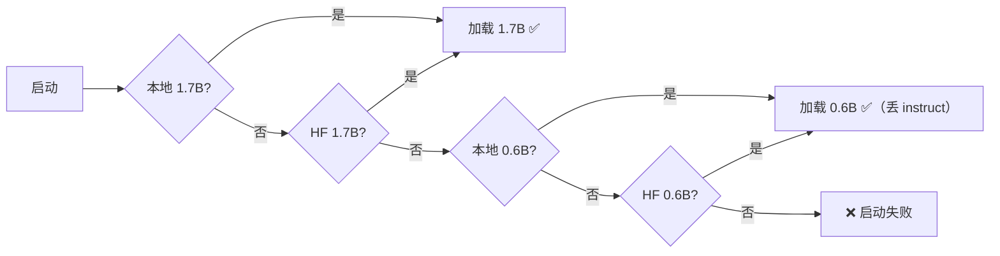

### 7.4 config/tts.yaml 关键配置

| 配置项 | 默认值 | 说明 |
|--------|--------|------|
| `tts.model_path` / `tts.fallback_model_path` | `./models/qwen-1.7b` / `./models/qwen-0.6b` | 主/备模型路径 |
| `tts.engine` | `sdpa` | 注意力实现（`sdpa` \| `flash_attention_2`） |
| `tts.dtype` | `bfloat16` | 计算精度 |
| `tts.default_voice` / `tts.default_language` | `aiden` / `English` | 兜底音色/语言（voice 留空时按语言自动匹配母语音色） |
| `tts.performance.compile` | `false` | torch.compile 优化（首次编译 2-5 分钟） |
| `tts.text.verify_text_threshold` | `40` | `is_single_word` 单词长度兜底上限 |
| `tts.decoding.short` | temp 0.5 / top_k 20 / rep 1.2 / max_new 512 / seed 42 | 单词语音确定性解码参数 |
| `tts.decoding.long` | temp 0.9 / max_new 2048 | 短句/长文本随机采样参数 |
| `tts.verification.max_retries` | `3` | 单词语音 ASR 校验最大重试（换 seed） |
| `tts.verification.asr_confidence_threshold` | `-1.0` | ASR 置信度门槛 |
| `tts.verification.word_max_duration_s` | `5.0` | 单词音频时长上限 |
| `tts.dictation.cache_dir` | `word-cache` | 词库缓存目录 |
| `tts.dictation.best_of` / `seed_base` | `3` / `1000` | 预生成候选数与 seed 起点 |

> 修改 `decoding.*` / `verification.*` / `model_path` 会自动改变 `gen_config_version`，词库缓存条目随之失效换代（见 CONSTRAINTS.md D2）。

---

## 8. 部署指南

### 8.1 本地部署

```bash
# 1. 创建虚拟环境
conda create -n memory-tts python=3.12
conda activate memory-tts

# 2. 安装依赖
pip install -r requirements.txt

# 3. 确保模型文件在 models/ 目录下

# 4. 启动服务
python main.py

# 或启用热重载（开发模式）
set RELOAD=1 && python main.py    # Windows
RELOAD=1 python main.py           # Linux/macOS
```

### 8.2 Docker 部署

```dockerfile
FROM python:3.12-slim
WORKDIR /app
COPY requirements.txt ./
RUN pip install --no-cache-dir -r requirements.txt
COPY . .
EXPOSE 8000
CMD ["python", "src/server.py"]
```

```bash
# 构建
docker build -t memory-tts .

# 运行（GPU 模式）
docker run -d -p 8000:8000 --gpus all -v ./models:/app/models memory-tts

# 运行（CPU 模式，速度较慢）
docker run -d -p 8000:8000 memory-tts
```

### 8.3 生产环境建议

1. **GPU 选择**：推荐 NVIDIA T4 / A10 / A100，至少 8 GB 显存
2. **反向代理**：Nginx 提供 SSL 终止和请求缓存
3. **进程管理**：使用 systemd / supervisor 确保崩溃自动重启
4. **健康监控**：定时调用 `/api/v1/health`
5. **模型预热**：启动后发送一次预热请求，避免首个请求超时
6. **多实例**：多 GPU 场景可部署多个实例 + 负载均衡

---

## 9. 开发与调试

### 9.1 快速测试

```bash
# 健康检查
curl http://localhost:8000/api/v1/health

# 音色列表
curl http://localhost:8000/api/v1/tts/voices

# TTS 合成测试
curl -X POST http://localhost:8000/api/v1/tts/synthesize \
  -H "Content-Type: application/json" \
  -d '"'"'{"text":"Hello world","voice":"aiden","language":"English"}'"'"' \
  --output test.wav

# ASR 转录测试
curl -X POST http://localhost:8000/api/v1/asr/transcribe \
  -F "audio=@test.wav" -F "language=en"

# 音素发音评价测试
curl -X POST http://localhost:8000/api/v1/pronunciation/phoneme-score \
  -F "student_audio=@recording.wav" \
  -F "reference_text=hello world" \
  -F "language=en"
```

### 9.2 管理后台

浏览器访问 `http://localhost:8000/admin` 打开调试面板（含词库管理，见 4.7 节）。旧版 Gradio 调试界面（`debug_ui.py`）已移除。

### 9.3 FastAPI 自动文档

服务启动后访问：
- Swagger UI：`http://localhost:8000/docs`
- ReDoc：`http://localhost:8000/redoc`

### 9.4 代码规范

- **命名**：Python 使用 `snake_case`，API 输出支持 camelCase 转换
- **类型注解**：所有函数参数和返回值均使用类型注解
- **错误处理**：`HTTPException` 返回统一格式 `{"detail": "..."}`
- 🔥 **架构约束**：TTS 服务端不注入情绪指令、单词语音判定规则、缓存换代机制、模型锁并发边界等**必须遵守的约束**见 `docs/CONSTRAINTS.md`（修改相关代码前必读）

---

## 10. 常见问题与排错

### 10.1 "flash-attn 未安装" 警告

```
UserWarning: flash-attn is not installed, using pytorch sdpa implementation
```

**原因**：`flash-attn` 是可选优化库，非必需。  
**解决**：忽略此警告，项目已使用 PyTorch 原生 SDPA（Scaled Dot-Product Attention）替代。

### 10.2 CUDA 显存不足

```
RuntimeError: CUDA out of memory
```

**解决**：
1. 确保使用 0.6B 小模型（默认）
2. 关闭其他占用显存的程序（如 `nvidia-smi` 查看）
3. 降级到 CPU 模式（移除 CUDA 版 PyTorch）

### 10.3 HuggingFace 下载失败

```
requests.exceptions.SSLError: certificate verify failed
```

**解决**：
```bash
set HF_HUB_DISABLE_SSL_VERIFY=1    # Windows
export HF_HUB_DISABLE_SSL_VERIFY=1 # Linux/macOS
```

或直接使用本地模型文件（放在 `models/` 目录下）。

### 10.4 TTS 模型加载失败

**现象**：服务启动时模型加载失败。  
**排查步骤**：
1. 检查 `models/qwen-0.6b/` 和 `models/qwen-1.7b/` 目录是否存在
2. 检查 HuggingFace 网络连通性
3. 检查 PyTorch 版本与 CUDA 版本匹配
4. 如两套模型都失败，服务将抛出 `RuntimeError` 无法启动

### 10.5 音素评分返回 400

**现象**：`POST /api/v1/pronunciation/phoneme-score` 返回 400。  
**常见原因**：
- 未传入 `reference_text` 非文件参数（需使用 `Form(...)` 声明）
- 音频格式不支持（仅 `.wav/.mp3/.flac/.m4a`）
- 音频为空或时长 < 0.3 秒

### 10.6 端口占用

```bash
# Windows
netstat -ano | findstr :8000
# 在任务管理器中结束对应 PID

# Linux
lsof -i :8000
kill -9 <PID>
```

---

## 附录 A：音色完整速查表

| 音色 ID | 名称 | 母语 | 性别 | 风格描述 | 类型 |
|---------|------|------|------|---------|------|
| `ryan` | Ryan | 英文 | 男 | 富有节奏感的动感男声 | preset |
| `aiden` | Aiden | 英文 | 男 | 阳光美式男声，音色明亮 | preset |
| `vivian` | Vivian | 中文 | 女 | 明亮、略带锋芒的年轻女性声音 | preset |
| `serena` | Serena | 中文 | 女 | 温暖、温柔的年轻女性声音 | preset |
| `uncle_fu` | Uncle_Fu | 中文 | 男 | 经验丰富的男性嗓音，低沉柔和 | preset |
| `dylan` | Dylan | 中文（北京话） | 男 | 年轻北京男性，清晰自然 | preset |
| `eric` | Eric | 中文（四川话） | 男 | 活泼成都男声，沙哑明亮 | preset |
| `ono_anna` | Ono_Anna | 日文 | 女 | 活泼日本女性，轻盈灵巧 | preset |
| `sohee` | Sohee | 韩文 | 女 | 温暖韩国女性，情感丰富 | preset |

> 与模型 README 官方清单一致；`voice` 留空时按 `language` 自动匹配母语音色（English→aiden、Chinese→vivian、Japanese→ono_anna、Korean→sohee）。

## 附录 B：发音评分等级对照

| 分数范围 | 等级 | 反馈建议 |
|---------|------|---------|
| 90-100 | excellent | 发音非常标准，继续保持！ |
| 75-89 | good | 发音良好，注意个别音节的准确性 |
| 60-74 | fair | 发音基本正确，需要加强练习 |
| 40-59 | poor | 发音有待改进，建议多听标准发音 |
| 0-39 | very_poor | 发音需要大幅改进，建议从基础音标开始练习 |

## 附录 C：ASR 模型尺寸对比

| 模型 | 参数量 | 相对速度 | 英文 WER | 推荐显存 | 适用场景 |
|------|--------|---------|----------|---------|---------|
| `tiny` | 39M | 10× | 7.5% | 1 GB | 低资源设备 |
| `base` | 74M | 6× | 5.5% | 1.5 GB | **当前默认** |
| `small` | 244M | 2.5× | 4.1% | 2.5 GB | 精度与速度平衡 |
| `medium` | 769M | 1× | 3.4% | 5 GB | 高精度需求 |
| `large-v3` | 1.55B | 0.4× | 2.7% | 10 GB | 最高精度 |

> 当前服务通过 `WHISPER_MODEL_SIZE=base` 环境变量配置，默认使用 `base` 模型。

## 附录 D：ARPAbet 音素对照表

| 类别 | 音素 | 示例词 | 发音提示 |
|------|------|--------|---------|
| 元音 | AA | f**a**ther | 大开口低元音 |
| 元音 | AE | c**a**t | 次低前元音 |
| 元音 | AH | h**u**t | 中央元音 |
| 元音 | AO | d**o**g | 半低后圆唇元音 |
| 元音 | AW | h**ow** | AA+UH 双元音 |
| 元音 | AY | m**y** | AA+IH 双元音 |
| 元音 | EH | b**e**d | 半低前元音 |
| 元音 | ER | h**er** | 卷舌中央元音 |
| 元音 | EY | s**ay** | EH+IH 双元音 |
| 元音 | IH | b**i**t | 次高前元音 |
| 元音 | IY | b**ea**t | 高前元音 |
| 元音 | OW | g**o** | AH+UH 双元音 |
| 元音 | OY | b**oy** | AO+IH 双元音 |
| 元音 | UH | p**u**t | 次高后圆唇元音 |
| 元音 | UW | t**oo** | 高后圆唇元音 |
| 塞音 | P | **p**en | 双唇清塞音 |
| 塞音 | B | **b**ad | 双唇浊塞音 |
| 塞音 | T | **t**ea | 齿龈清塞音 |
| 塞音 | D | **d**og | 齿龈浊塞音 |
| 塞音 | K | **c**at | 软腭清塞音 |
| 塞音 | G | **g**o | 软腭浊塞音 |
| 擦音 | F | **f**ish | 唇齿清擦音 |
| 擦音 | V | **v**an | 唇齿浊擦音 |
| 擦音 | TH | **th**in | 齿间清擦音 |
| 擦音 | DH | **th**is | 齿间浊擦音 |
| 擦音 | S | **s**it | 齿龈清擦音 |
| 擦音 | Z | **z**oo | 齿龈浊擦音 |
| 擦音 | SH | **sh**e | 腭龈清擦音 |
| 擦音 | ZH | mea**s**ure | 腭龈浊擦音 |
| 塞擦音 | CH | **ch**in | T+SH 组合 |
| 塞擦音 | JH | **j**ump | D+ZH 组合 |
| 鼻音 | M | **m**om | 双唇鼻音 |
| 鼻音 | N | **n**o | 齿龈鼻音 |
| 鼻音 | NG | si**ng** | 软腭鼻音 |
| 流音 | L | **l**ight | 齿龈边音 |
| 流音 | R | **r**ed | 卷舌近音 |
| 滑音 | W | **w**et | 双唇软腭近音 |
| 滑音 | Y | **y**es | 硬腭近音 |
| 清声门擦音 | HH | **h**at | 声门清擦音 |
